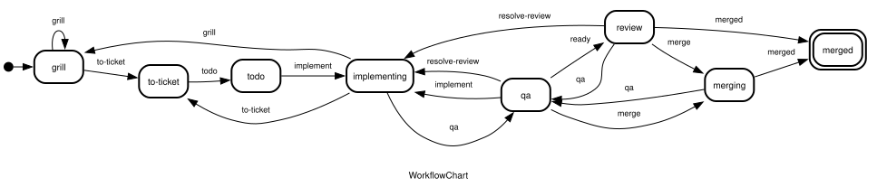
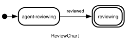

# mb-workflow

Workflow automation CLI.

Run from this directory:

```sh
uv run mw dev setup
uv run mb-workflow workspace create-reviews
```

All checks run through moon from the repository root: `moon ci`.

## The workflow state chart



## The review state chart

Review worktrees check out a teammate's pull request and follow a chart of their own.



