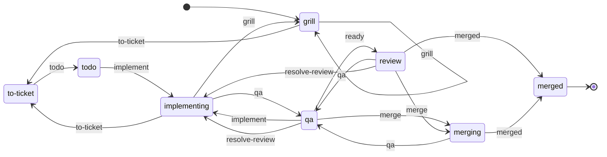

```mermaid
stateDiagram-v2
    direction LR
    state "to-ticket" as to_ticket
    [*] --> grill
    merged --> [*]
    grill --> grill : grill
    grill --> to_ticket : to-ticket
    to_ticket --> todo : todo
    todo --> implementing : implement
    implementing --> grill : grill
    implementing --> to_ticket : to-ticket
    implementing --> qa : qa
    qa --> implementing : implement
    qa --> review : ready
    qa --> merging : merge
    qa --> implementing : resolve-review
    review --> qa : qa
    review --> merging : merge
    review --> merged : merged
    review --> implementing : resolve-review
    merging --> qa : qa
    merging --> merged : merged
```
