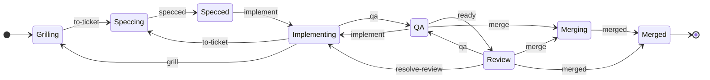

```mermaid
stateDiagram-v2
    direction LR
    state "Grilling" as grilling
    state "Speccing" as speccing
    state "Specced" as specced
    state "Implementing" as implementing
    state "QA" as qa
    state "Review" as review
    state "Merging" as merging
    state "Merged" as merged
    [*] --> grilling
    merged --> [*]
    grilling --> speccing : to-ticket
    speccing --> specced : specced
    specced --> implementing : implement
    implementing --> grilling : grill
    implementing --> speccing : to-ticket
    implementing --> qa : qa
    qa --> implementing : implement
    qa --> review : ready
    qa --> merging : merge
    review --> qa : qa
    review --> merging : merge
    review --> merged : merged
    review --> implementing : resolve-review
    merging --> merged : merged
```
